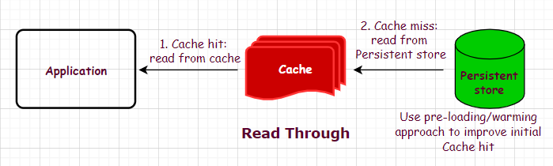
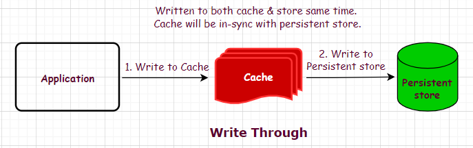
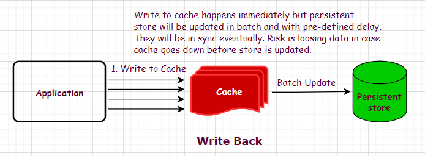

# Topics

* Cache - Redis, Memcache
	* Strategies:
		* cache-aside (most common)
			
			
			
		* read-through
			
			
			
		* write-through - RedisGear, Amazon DAX
			
			
			
		* write-back - RedisGear, Amazon DAX
			
			
		
	* Cache Eviction policies:
		* LRU - least recently used
		* LFU - least frequently used
		* noeviction
		* random

