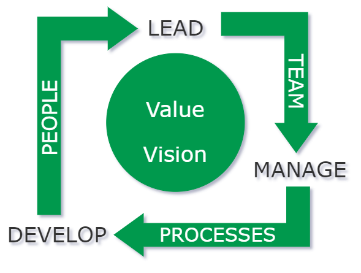

# Leadership

Leadership - a continuous learning and evolving process, getting better with experience and by learning from mistakes made during the journey.

- Leaders
	- develop others
	- formulate vision
	- work towards to make team self sustainable
	- build collaborative, inclusive environment
	- creates bi-directional feedback channel
	- challenge team to grow horizontally & vertically
	- 
	 

Few agile metrics to measure team performance
1. Productivity - Cycle Time
2. Predictability - Say Vs Do ratio
3. Quality - # of incidents, PRBs, escaped defects
4. Stability - Is team happy with sprint execution

I believe there is no pre-defined recipe for building a successful team. It's an art to identify right people who fit well in the team culture, have skills and/or potential to perform the role and responsibilites. 

To build a successful team as a leader, we can create an environment of:
1. Trust
2. Collaboration
3. Empathy
4. Open communication
5. Equal say
6. Innovation
7. Acceptance of failure
8. Accountability

